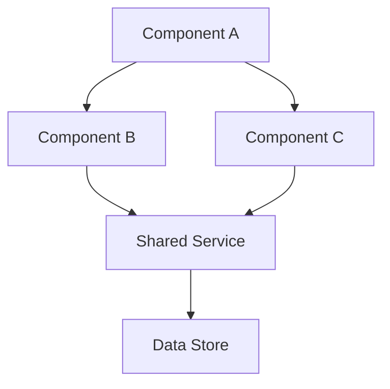
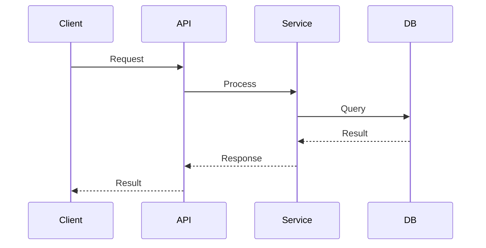

# create-architecture

## Overview

This skill helps you produce architecture documentation for a given epic. It generates **Architecture Decision Records (ADRs)**, **component diagrams**, **data-flow diagrams**, and a **tech-stack rationale** -- all scoped to the epic's requirements.

## When to Use

- At the start of a new epic that involves non-trivial design decisions
- When the manager triages a QA failure as a `design-issue`
- When adding a new subsystem, service, or integration layer

## Artifacts Produced

| Artifact | Format | Location |
|----------|--------|----------|
| ADR(s) | Markdown | `<war-room>/architecture/adr-NNN.md` |
| Component diagram | Mermaid in Markdown | `<war-room>/architecture/components.md` |
| Data-flow diagram | Mermaid in Markdown | `<war-room>/architecture/data-flow.md` |
| Tech-stack rationale | Markdown | `<war-room>/architecture/tech-stack.md` |
| Non-functional checklist | Markdown | `<war-room>/architecture/nfr-checklist.md` |

## Instructions

### 1. Create the Architecture Directory

```bash
mkdir -p <war-room-dir>/architecture
```

### 2. Write an Architecture Decision Record (ADR)

Create `<war-room>/architecture/adr-001.md` for each significant decision:

```markdown
# ADR-001: <Title of Decision>

> Status: proposed | accepted | deprecated | superseded
> Date: <YYYY-MM-DD>
> Epic: <EPIC-XXX>

## Context

<What is the problem or situation that requires a decision?
Include constraints, requirements, and forces at play.>

## Options Considered

### Option A -- <Name>
- **Pros:** <advantages>
- **Cons:** <disadvantages>

### Option B -- <Name>
- **Pros:** <advantages>
- **Cons:** <disadvantages>

## Decision

We chose **Option <X>** because <rationale>.

## Consequences

- **Positive:** <what improves>
- **Negative:** <what trade-offs are accepted>
- **Risks:** <what could go wrong>

## Follow-up Actions

- [ ] <action item 1>
- [ ] <action item 2>
```

Number ADRs sequentially: `adr-001.md`, `adr-002.md`, etc.

### 3. Create a Component Diagram

Create `<war-room>/architecture/components.md`:

````markdown
# Component Architecture -- EPIC-XXX

## Overview

<Brief description of the system's major components and their relationships.>

## Diagram



## Component Descriptions

| Component | Responsibility | Technology |
|-----------|---------------|------------|
| Component A | <what it does> | <tech used> |
| Component B | <what it does> | <tech used> |
````

### 4. Create a Data-Flow Diagram

Create `<war-room>/architecture/data-flow.md`:

````markdown
# Data Flow -- EPIC-XXX

## Overview

<Description of how data moves through the system.>

## Diagram



## Data Contracts

| Endpoint / Event | Payload | Direction |
|-----------------|---------|-----------|
| `POST /resource` | `{ field: type }` | Client  API |
| `event.created` | `{ id, timestamp }` | Service  Queue |
````

### 5. Write Tech-Stack Rationale

Create `<war-room>/architecture/tech-stack.md`:

```markdown
# Tech Stack Rationale -- EPIC-XXX

## Chosen Stack

| Layer | Technology | Reason |
|-------|-----------|--------|
| Frontend | <tech> | <why> |
| Backend | <tech> | <why> |
| Database | <tech> | <why> |
| Messaging | <tech> | <why> |

## Alternatives Rejected

| Technology | Reason for Rejection |
|-----------|---------------------|
| <tech> | <why not> |

## Compatibility

- Existing codebase: <compatible / requires adapter>
- Team skills: <familiar / learning curve>
- Deployment: <fits current infra / needs new setup>
```

### 6. Fill the Non-Functional Requirements Checklist

Create `<war-room>/architecture/nfr-checklist.md`:

```markdown
# Non-Functional Requirements -- EPIC-XXX

## Checklist

- [ ] **Scalability** -- Can handle projected load? Horizontal scaling strategy defined?
- [ ] **Performance** -- Latency targets set? Caching strategy defined?
- [ ] **Security** -- Auth/authz model documented? Input validation? Secrets management?
- [ ] **Observability** -- Logging strategy? Metrics? Tracing? Health checks?
- [ ] **Reliability** -- Failure modes identified? Retry / circuit-breaker in place?
- [ ] **Maintainability** -- Code organized for future changes? Dependencies minimal?
- [ ] **Testability** -- Can components be tested in isolation? Integration test plan?
- [ ] **Accessibility** -- WCAG compliance (if UI)? Screen reader support?

## Notes

<Any additional non-functional considerations specific to this epic.>
```

## Verification

After generating architecture docs:

1. All Mermaid diagrams render correctly (paste into a Mermaid live editor)
2. ADRs have a clear **Decision** and **Consequences** section
3. Tech-stack choices align with the project's existing `config.json` where applicable
4. NFR checklist items are addressed or explicitly marked as N/A
