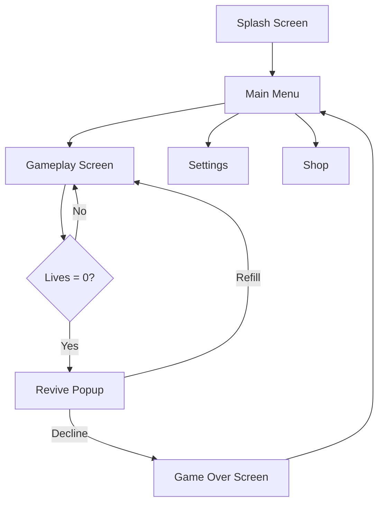

# Workflow: Create UX Design

**Goal:** Create comprehensive UX design specifications for all game screens, UI flows, and interaction patterns — producing a design document that the engineer role can implement directly.

**Prerequisites:** `gdd.md` must exist with UI/UX section
**Input:** `.output/design/gdd.md` + `.output/design/game-brief.md`
**Output:** `.output/design/ux-design.md` — complete UX specification with screen flows, component specs, and animation guidelines

---

## Step 1 — Load Prerequisites

1. Load `.output/design/gdd.md`. Extract:
   - Section 4 (UI/UX Design): all key screens
   - Core loop description: what actions the player takes
   - Game pillars: especially any "feel" or "aesthetic" pillars
2. Load `.output/design/game-brief.md` for visual direction
3. Load `project-context.md` for Unity-specific constraints (canvas setup, TextMeshPro, etc.)

Present: "Loaded GDD. Found {N} screens to design: {list}. Ready to begin UX design."

---

## Step 2 — Define Experience Goals

Before designing screens, define the emotional UX goals:

Ask:
1. "What should the player feel when they open the app? (3 words)"
2. "What is the ONE screen that makes or breaks retention? (e.g., main game screen)"
3. "Describe the target player's typical session: {duration}, {context}, {mood}"
4. "Which competitor apps have UX you admire? What specifically works?"
5. "What UX pattern must absolutely NOT exist? (e.g., no tutorial popups that block gameplay)"

Compile into **UX Principles** (3-5 non-negotiable rules):
```
> **Principle 1: {Name}** — {what this means for every screen decision}
```

Confirm with user: "These are the UX principles I'll validate every screen against. Correct?"

---

## Step 3 — Design Each Screen

For each screen identified from the GDD, write a complete spec.

**Screen spec format:**

```markdown
### Screen: {Name}

**Purpose:** {1 sentence — what the player does here}
**Entry from:** {which screen/trigger leads here}
**Exit to:** {which screens the player can navigate to}
**Layer/Z-order:** {Screen Space Overlay | World Space}

#### Layout

```
[ASCII wireframe or description of layout]
TOP:     [Header/HUD element]
CENTER:  [Primary content area]
BOTTOM:  [Action buttons]
OVERLAY: [Modal, popup elements]
```

#### UI Elements

| Element | Type | Content | Behavior |
|---------|------|---------|---------|
| {name} | Button / Image / TMP / Panel | {text or asset} | {what happens on interaction} |

#### Interactions

- **Tap {element}:** {what happens — animation, navigation, data change}
- **Long press {element}:** {if applicable}
- **Swipe:** {if applicable}

#### State Variations

- **Default state:** {description}
- **Loading state:** {skeleton UI / spinner / etc.}
- **Error state:** {how errors are shown}
- **Empty state:** {if applicable — no data available}

#### Unity uGUI Notes

- Canvas: {Screen Space Overlay / World Space}
- {Element}: `{UnityComponentType}` — {specific note, e.g., "Use TextMeshProUGUI not Text"}
- Fades: Use `CanvasGroup.alpha` — never `Image.color.a` directly
- {Performance note if applicable}
```

After each screen: "Happy with this screen design? (C to continue / F for feedback)"

---

## Step 4 — Define Navigation Flow

Create the complete navigation map:

```markdown
## Navigation Flow



### Transition Animations

| From → To | Animation | Duration |
|-----------|-----------|---------|
| Main Menu → Gameplay | Slide left | 0.3s ease-in |
| Gameplay → Revive Popup | Fade overlay + scale-in popup | 0.2s |
| Popup → Gameplay | Scale-out popup + fade overlay | 0.3s |
```

---

## Step 5 — Define Animation & Feedback Patterns

For each key feedback moment, specify the micro-animation:

```markdown
## Feedback Animations

### Score / Value Change
- Duration: 0.4s
- Pattern: Number count up with scale 1.0→1.15→1.0 (ease in-out)

### Button Press
- Duration: 0.12s
- Pattern: Scale 1.0→0.95→1.0 (immediate response)

### Success / Level Complete
- Duration: 1.2s
- Pattern: {Stars fly in / Confetti / Score multiply / etc.}

### Error / Failure
- Duration: 0.4s  
- Pattern: Shake (horizontal, 3 cycles, ±8px) + flash red tint

### Reward / Unlock
- Duration: 0.8s
- Pattern: Scale-in with bounce (overshoot 1.2, settle 1.0) + particle effect

### Loading
- Pattern: {Spinner / Progress bar / Skeleton UI}
```

---

## Step 6 — Component Style Guide

Define the visual component standards that the engineer implements:

```markdown
## Component Style Guide

### Color Palette
| Role | Hex | Usage |
|------|-----|-------|
| Primary action | #{hex} | Main buttons, key CTAs |
| Secondary action | #{hex} | Secondary buttons |
| Background | #{hex} | Screen backgrounds |
| Surface | #{hex} | Cards, panels |
| Text primary | #{hex} | Headings, primary text |
| Text secondary | #{hex} | Descriptions, labels |
| Success | #{hex} | Positive feedback |
| Error | #{hex} | Error states |

### Typography
| Style | Font | Size | Weight | Usage |
|-------|------|------|--------|-------|
| Heading 1 | {font} | {size}pt | Bold | Screen titles |
| Heading 2 | {font} | {size}pt | Semi-bold | Section headers |
| Body | {font} | {size}pt | Regular | Descriptions |
| Caption | {font} | {size}pt | Regular | Labels, hints |
| Button | {font} | {size}pt | Bold | Button labels |

All text: `TextMeshProUGUI` — never use legacy `Text` component.

### Spacing System
- Base unit: 8px
- Padding: 8, 16, 24, 32px
- Margin between elements: 8, 16px

### Button States
- Default: {description}
- Hover/Press: Scale 0.95, brightness +10%
- Disabled: 50% opacity
- Loading: Show spinner, disable interaction
```

---

## Step 7 — Accessibility & Mobile Constraints

```markdown
## Mobile UX Constraints

### Touch Targets
- Minimum: 44x44pt (Apple HIG)
- Recommended: 56x56pt for primary actions
- Thumb zone: Primary actions in bottom 60% of screen

### Safe Areas
- iPhone: Top 44pt, Bottom 34pt (safe area insets)
- Android: Status bar 24pt, nav bar variable
- Implementation: Use Unity's `Screen.safeArea` with RectTransform anchors

### Performance UX
- No layout rebuild during animations (freeze RectTransforms when animating)
- Avoid Canvas.worldCamera changes — use Screen Space Overlay
- Max draw calls: {budget} per frame
- UI update frequency: Only on data change, never per-frame
```

---

## Step 8 — Validation Pass

Before saving, validate every screen spec:

- [ ] Every screen has purpose, entry, exit, and element table
- [ ] All interactive elements have defined behaviors
- [ ] State variations (default/loading/error/empty) defined for data-driven screens
- [ ] Navigation flow diagram is complete
- [ ] All feedback animations have duration and pattern
- [ ] Touch targets ≥ 44pt for all interactive elements
- [ ] Unity-specific: TextMeshProUGUI, CanvasGroup, Screen.safeArea documented

Fix any failing items before proceeding.

---

## Step 9 — Save

1. Create `.output/design/` if needed.
2. Save to `.output/design/ux-design.md`.
3. Report: "UX design saved to `.output/design/ux-design.md`."
4. Suggest next steps:
   - "Check implementation readiness: `[architect] check-implementation-readiness`"
   - "Hand off to engineer: `[engineer] implement story E{N}-{N}`"
