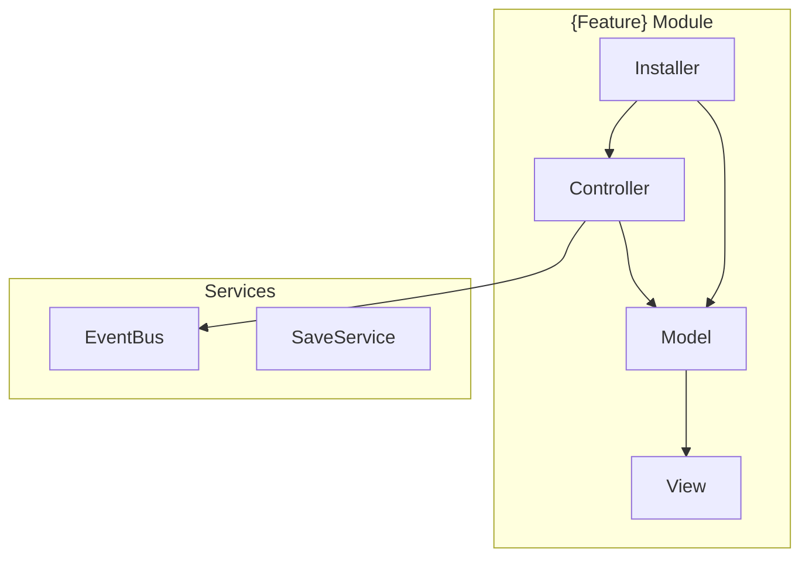

# Workflow: Document Project

**Goal:** Produce comprehensive documentation of an existing Unity project — scanning codebase, architecture, and systems to create an up-to-date technical reference for new team members and AI agents.

**Use when:** Brownfield project needs documentation, onboarding new agents/developers
**Input:** Existing Unity project codebase + any design docs
**Output:** `.output/docs/project-documentation.md` — complete project reference

---

## Step 1 — Project Discovery

Scan the project:

1. Read `ProjectSettings/ProjectVersion.txt` → Unity version
2. Read `Packages/manifest.json` → all packages + versions
3. Scan `Assets/Scripts/` recursively — list namespaces and key class names
4. Scan `Assets/Editor/` — list all editor scripts and `[MenuItem]` paths
5. Scan `Assets/Tests/` — test count and coverage
6. Check for existing docs: `project-context.md`, `.output/design/gdd.md`, `README.md`

Count and present: "{N} scripts across {N} namespaces, {N} editor tools, {N} test files. Found docs: {list}."

---

## Step 2 — Architecture Analysis

For each major system (feature module):

1. Identify the pattern (Feature Module with Controller/Model/View)
2. Map class relationships
3. Identify VContainer installer locations
4. Note deviations from the standard pattern
5. Extract key public interfaces

Generate Mermaid system diagram:



---

## Step 3 — Write Documentation

```markdown
# {Project Name} — Technical Documentation

> Generated: {date} | Unity {version}
> Read this before implementing any code for this project.

## Quick Reference

| What | Where |
|------|-------|
| Main scene | {path} |
| DI container | VContainer — installers in `Assets/Scripts/{path}` |
| Async pattern | UniTask |
| Reactive pattern | UniRx |
| UI system | uGUI + TextMeshPro |
| Editor tools | {list of GameObject > ... paths} |
| Tests | `Assets/Tests/EditMode/` + `Assets/Tests/PlayMode/` |

## System Architecture

{Mermaid diagram of all systems}

## Module Reference

### {Feature} Module
**Purpose:** {what this module owns}
**Key classes:**
- `{Feature}Controller` — {responsibility}
- `{Feature}Model` — {responsibility}
- `{Feature}View` — {responsibility}
**Entry point:** {how to invoke this system}

{repeat for each module}

## Editor Scripts

| MenuItem Path | Script | What It Creates |
|--------------|--------|----------------|
| `GameObject/UI/{Feature}` | `{Feature}SceneBuilder.cs` | {description} |

## Testing

| Type | Location | Count | How to Run |
|------|----------|-------|-----------|
| EditMode | `Assets/Tests/EditMode/` | {N} | Window > Test Runner > EditMode |
| PlayMode | `Assets/Tests/PlayMode/` | {N} | Window > Test Runner > PlayMode |
| Performance | `Assets/Tests/Performance/` | {N} | Unity Performance Testing |

## Conventions

{Copy key rules from project-context.md}

- **Naming:** {pattern}
- **Folders:** {structure}
- **DI:** {VContainer pattern}
- **Async:** {UniTask pattern}

## Known Gotchas

{List 3-5 things that are non-obvious or have caused bugs}
```

---

## Step 4 — Save

1. Create `.output/docs/` if needed.
2. Save to `.output/docs/project-documentation.md`.
3. Report: "Documentation complete. {N} systems documented, {N} editor tools listed."
4. Suggest: "Update `project-context.md` with any conventions found: `[architect] generate-project-context`"
