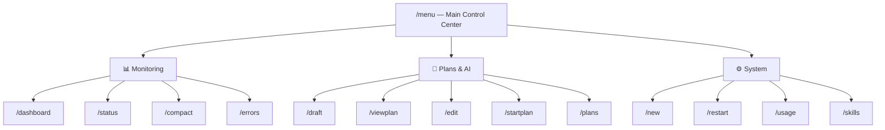

# Telegram Bot — Main Control Center Menu

## Overview

Redesign `/menu` as a **three-section hub** using Telegram inline keyboards. Each section opens a sub-menu with actionable buttons that invoke the existing command handlers.



## Proposed Changes

### [MODIFY] [telegram_poller.py](file:///E:/OS%20Twin/os-twin/dashboard/telegram_poller.py)

#### 1. Redesign [_cmd_menu()](file:///E:/OS%20Twin/os-twin/dashboard/telegram_poller.py#190-198) (line ~190)

Replace the current flat keyboard with 3 category buttons:

```python
async def _cmd_menu(bot_token: str, chat_id: int):
    keyboard = [
        [{"text": "📊 Monitoring", "callback_data": "menu:cat:monitoring"}],
        [{"text": "📝 Plans & AI", "callback_data": "menu:cat:plans"}],
        [{"text": "⚙️ System",     "callback_data": "menu:cat:system"}],
    ]
    await send_inline_keyboard(
        bot_token, chat_id,
        "🏢 *Main Control Center*\nSelect a category:",
        keyboard
    )
```

#### 2. Add 3 sub-menu functions

```python
async def _cmd_submenu_monitoring(bot_token, chat_id):
    keyboard = [
        [{"text": "📊 Dashboard",       "callback_data": "cmd:dashboard"}],
        [{"text": "💻 Status",          "callback_data": "cmd:status"}],
        [{"text": "💬 Compact View",    "callback_data": "cmd:compact"}],
        [{"text": "⚠️ Errors",          "callback_data": "cmd:errors"}],
        [{"text": "⬅️ Back",            "callback_data": "menu:main"}],
    ]
    await send_inline_keyboard(bot_token, chat_id,
        "📊 *Monitoring*\nReal-time War-Room insights:", keyboard)

async def _cmd_submenu_plans(bot_token, chat_id):
    keyboard = [
        [{"text": "✨ Draft New Plan",  "callback_data": "cmd:draft_prompt"}],
        [{"text": "👁 View Plan",       "callback_data": "cmd:viewplan"}],
        [{"text": "✏️ Edit Plan",       "callback_data": "cmd:edit"}],
        [{"text": "🚀 Launch Plan",     "callback_data": "cmd:startplan"}],
        [{"text": "📂 All Plans",       "callback_data": "menu:plans"}],
        [{"text": "⬅️ Back",            "callback_data": "menu:main"}],
    ]
    await send_inline_keyboard(bot_token, chat_id,
        "📝 *Plans & AI*\nDraft, view, edit, and launch plans:", keyboard)

async def _cmd_submenu_system(bot_token, chat_id):
    keyboard = [
        [{"text": "🧹 Clean War-Rooms", "callback_data": "cmd:new"}],
        [{"text": "🔄 Restart",         "callback_data": "cmd:restart"}],
        [{"text": "📈 Token Usage",     "callback_data": "cmd:usage"}],
        [{"text": "🧠 Skills",          "callback_data": "cmd:skills"}],
        [{"text": "⬅️ Back",            "callback_data": "menu:main"}],
    ]
    await send_inline_keyboard(bot_token, chat_id,
        "⚙️ *System*\nSystem operations & resources:", keyboard)
```

#### 3. Expand [handle_callback_query()](file:///E:/OS%20Twin/os-twin/dashboard/telegram_poller.py#149-187) dispatch (line ~168)

Add new routing for the category buttons and command buttons:

```python
# Sub-menu navigation
elif data == "menu:cat:monitoring":
    await _cmd_submenu_monitoring(bot_token, chat_id)
elif data == "menu:cat:plans":
    await _cmd_submenu_plans(bot_token, chat_id)
elif data == "menu:cat:system":
    await _cmd_submenu_system(bot_token, chat_id)

# Direct command triggers from sub-menus
elif data == "cmd:dashboard":
    await send_reply(bot_token, chat_id, _cmd_dashboard())
elif data == "cmd:status":
    await send_reply(bot_token, chat_id, _cmd_status())
elif data == "cmd:compact":
    await send_reply(bot_token, chat_id, _cmd_compact())
elif data == "cmd:errors":
    await send_reply(bot_token, chat_id, _cmd_errors())
elif data == "cmd:draft_prompt":
    await send_reply(bot_token, chat_id, "✨ Send `/draft <your idea>` to create a new plan.")
elif data == "cmd:viewplan":
    await _cmd_viewplan_menu(bot_token, chat_id)
elif data == "cmd:edit":
    await _cmd_edit_menu(bot_token, chat_id)
elif data == "cmd:startplan":
    await _cmd_startplan_menu(bot_token, chat_id)
elif data == "cmd:new":
    await send_reply(bot_token, chat_id, _cmd_new())
elif data == "cmd:restart":
    await send_reply(bot_token, chat_id, "🔄 Restarting...")
    os.kill(os.getpid(), signal.SIGTERM)
elif data == "cmd:usage":
    await send_reply(bot_token, chat_id, _cmd_usage())
elif data == "cmd:skills":
    await send_reply(bot_token, chat_id, _cmd_skills())
```

#### 4. Add `register_commands()` and call at startup

Registers the 5 top-level commands with Telegram's `setMyCommands` API so they appear in the "Menu" button:

| Command | Description |
|---------|-------------|
| `/menu` | 🏢 Main Control Center |
| `/dashboard` | 📊 Real-time War-Room progress |
| `/draft` | 📝 Draft a new Plan with AI |
| `/status` | 💻 List running War-Rooms |
| `/help` | ❓ Detailed user guide |

Called once at the top of [start_polling()](file:///E:/OS%20Twin/os-twin/dashboard/telegram_poller.py#605-637).

---

### [MODIFY] [test_telegram_commands.py](file:///E:/OS%20Twin/os-twin/dashboard/tests/test_telegram_commands.py)

- Update [test_cmd_menu](file:///E:/OS%20Twin/os-twin/dashboard/tests/test_telegram_commands.py#32-42) to verify the 3 category buttons (`menu:cat:monitoring`, `menu:cat:plans`, `menu:cat:system`)
- Add `test_submenu_monitoring`, `test_submenu_plans`, `test_submenu_system` to verify each sub-menu's keyboard
- Add `test_register_commands` to verify `setMyCommands` API call
- Add `test_callback_cmd_dispatch` to verify `cmd:*` callback routing

## Verification Plan

### Automated Tests
```bash
cd /mnt/e/OS\ Twin/os-twin
python -m pytest dashboard/tests/test_telegram_commands.py -v
```

### Manual Verification
1. Start the bot → confirm "Menu" button shows 5 commands
2. Send `/menu` → see 3 category buttons
3. Tap each category → see correct sub-menu with ⬅️ Back
4. Tap each command button → get the expected response
